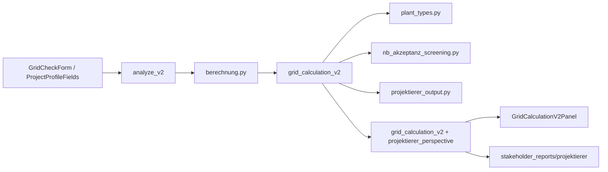

# Projektierer-Wizard — Architektur

## Ziel

Strukturierte Vorplanung für Netzanschlussprojekte (Projektierer-Perspektive): Anlagentyp, AC/DC, EEG §9, Blindleistung, NVP-Heuristik, BKZ-Band, Zeitplan — **ohne** verbindliche VNB-Zusage oder freie Kapazitätsbehauptung.

## Datenfluss

## Backend-Module

| Modul | Aufgabe |
|-------|---------|
| `plant_types.py` | `PlantType`, `PLANT_TYPE_CONFIG` (cos φ, Gleichzeitigkeit, Normfamilie, DC/AC-Flag) |
| `grid_calculation_types.py` | Erweitertes `GridConnectionInput`, `ReactivePowerScreening`, `ProjektiererPerspective` |
| `nb_akzeptanz_screening.py` | EEG-Klasse (`none` / `remote_control` / `direct_marketing`), Q(U)-Screening ab 135 kW AC |
| `projektierer_output.py` | `process_timeline`, `bkz_hint`, `nvp_recommendation`, `tab_disclaimer`, Kumulations-Hinweis |
| `grid_calculation_v2.py` | Verdrahtung, Engine v2.3.0, Screening-Leistung mit Gleichzeitigkeit |

## Regeln (konservativ)

- **Netzanschlussleistung** = AC (`ac_kw` oder `leistung_mw` × 1000).
- **Screening-Leistung** = AC × Gleichzeitigkeitsfaktor (Erzeugung), dokumentiert in Annahmen.
- **DC/AC** nur Transparenz und Erzeugungsnachweise, nicht für „freie Kapazität“.
- **EEG §9 2023**: &lt;25 kW `none`, 25–&lt;100 kW `remote_control`, ≥100 kW `direct_marketing`.
- **Blindleistung**: qualitatives Screening ab 135 kW AC, keine Q-Berechnung im MVP.
- **NVP / BKZ / Zeitplan**: heuristisch, mit Disclaimer.

## Frontend

- `lib/plant-types.ts` — deutsche UI-Labels
- `ProjectProfileFields` — Wizard-Felder Anlage & Netz
- `GridCalculationV2Panel` — Anzeige `projektierer_perspective`, EEG-Klasse, Q-Screening
- `lib/schemas/grid-calculation.ts` — Zod-Spiegel

## Grenzen (bewusst)

- Kein Kumulations-Check über Feeder (nur Warnung).
- Szenarienvergleich: Hinweis auf `/projects/[id]/szenarien-vergleich`, keine Engine-Logik im MVP.
- PDF: neue Blöcke über `grid_calculation_v2` / Mapper, sobald Report-Template erweitert wird.

## Tests

- `tests/test_projektierer_plant_types.py` — PV 5 MW, EEG 30 kW, Q 150 kW
- `tests/test_nb_akzeptanz_screening.py` — EEG-Klasse
- `tests/test_grid_calculation_v2.py` — Adapter / Version
