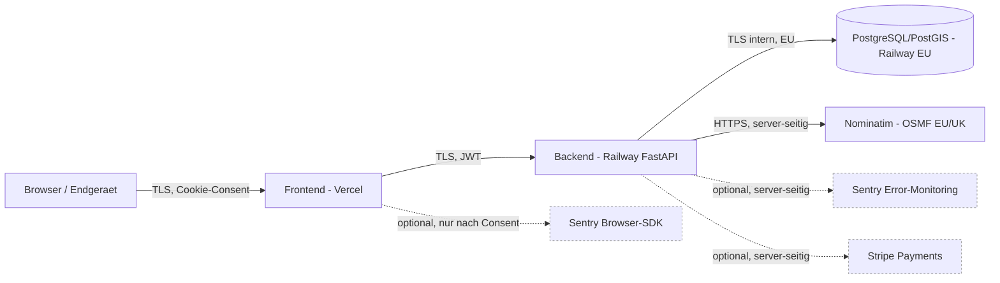

# Datenfluss-Diagramm — GridCheck

> **Status: ENTWURF — Stand 2026-06-14, technisch konsistent zu `frontend/lib/legal.ts` (`DATA_PROCESSORS`).**

---

## 1. Mermaid-Diagramm

Legende:

- durchgezogene Linien = aktiv im Live-Build
- gestrichelte Linien = optional / inaktiv (`active: false` in `DATA_PROCESSORS`)

---

## 2. Pfeile im Detail

### A) Browser -> Vercel (Frontend)

| Aspekt | Wert |
|--------|------|
| Daten | Anfrage-Daten (URL, IP, User-Agent), UI-Eingaben (E-Mail beim Login, Projektdaten) |
| Rechtsgrundlage | Art. 6 Abs. 1 lit. b DSGVO (Vertragserfuellung) — vorvertragliche Massnahmen |
| TOMs | TLS, sichere Cookies (HttpOnly, SameSite), CSP, HSTS |
| Aufbewahrung | Edge-Logs Vercel: gemaess Vercel-DPA (Kurzfrist), keine eigene Persistenz im Frontend |

### B) Vercel -> Railway (Backend FastAPI)

| Aspekt | Wert |
|--------|------|
| Daten | Authentifizierte API-Calls (JWT), Form-/JSON-Bodies (Projektdaten), Standortabfragen |
| Rechtsgrundlage | Art. 6 Abs. 1 lit. b DSGVO + Art. 6 Abs. 1 lit. f DSGVO (Sicherheit/Stabilitaet) |
| TOMs | TLS, Auth (JWT, bcrypt), CORS-Whitelist, Rate-Limiting, BOLA-Schutz |
| Aufbewahrung | API-Logs strukturiert (structlog), 30–90 Tage |

### C) Railway-Backend -> PostgreSQL/PostGIS (Railway, EU)

| Aspekt | Wert |
|--------|------|
| Daten | Persistente Stammdaten, Projektdaten, Audit-Hash-Chain |
| Rechtsgrundlage | Art. 6 Abs. 1 lit. b DSGVO i.V.m. Art. 28 DSGVO (Auftragsverarbeitung Railway) |
| TOMs | EU-Region, verwaltete Backups (taeglich), TLS intern, Append-only Audit-Tables |
| Aufbewahrung | Stammdaten/Projekt: bis Soft-Delete + Frist; Audit: 6/10 Jahre (§ 257 HGB / § 147 AO) |

### D) Backend -> Nominatim (OpenStreetMap Foundation, EU/UK)

| Aspekt | Wert |
|--------|------|
| Daten | Adressanfragen (Strasse/Ort) bzw. Koordinaten fuer Reverse-Geocoding |
| Rechtsgrundlage | Art. 6 Abs. 1 lit. b DSGVO (Vertragserfuellung) bzw. Art. 6 Abs. 1 lit. f DSGVO |
| TOMs | HTTPS, serverseitiger Aufruf (Browser-IP wird **nicht** weitergeleitet), faire Nutzung gemaess Nominatim Usage Policy |
| Aufbewahrung | Bei OSMF gemaess deren Privacy Policy (Verbindungs-Logs Kurzfrist) |

### E) Backend -> Sentry (optional, derzeit inaktiv)

| Aspekt | Wert |
|--------|------|
| Daten | Stacktraces, Fehlermetadaten, ggf. User-Hash, Browser-/Geraete-Hinweise |
| Rechtsgrundlage | Art. 6 Abs. 1 lit. f DSGVO (berechtigtes Interesse Stabilitaet) bzw. Einwilligung im Browser-SDK |
| TOMs | SCC + EU-US DPF, PII-Scrubbing serverseitig, optional EU-Region waehlbar |
| Aufbewahrung | Gemaess Sentry-DPA, typischerweise 30–90 Tage |

### F) Backend -> Stripe (optional, derzeit inaktiv)

| Aspekt | Wert |
|--------|------|
| Daten | Zahlungsmetadaten (Beleg-/Abo-Status), Rechnungs-Stammdaten — Zahlungsdaten direkt bei Stripe |
| Rechtsgrundlage | Art. 6 Abs. 1 lit. b DSGVO + Art. 28 DSGVO + Art. 46 DSGVO (SCC) + EU-US DPF |
| TOMs | Stripe-eigene PCI-DSS-Infrastruktur, kein Card-Pan im eigenen System |
| Aufbewahrung | 10 Jahre (§ 257 HGB / § 147 AO) fuer Buchhaltungsbelege |

### G) Cookie-Consent (Browser-lokal)

| Aspekt | Wert |
|--------|------|
| Daten | Consent-Status (lokal), Praeferenzen |
| Rechtsgrundlage | TTDSG § 25 Abs. 2 Nr. 2 (technisch notwendig) bzw. Einwilligung (Opt-In) |
| TOMs | Sichere Cookies, granulare Widerruflichkeit, kein nicht-essenzieller Cookie vor Consent |
| Aufbewahrung | Cookie-Lebensdauer gemaess Consent-Banner-Konfiguration |

---

## 3. Hinweise

- Daten werden **nicht** mit Werbe-/Tracking-Anbietern geteilt.
- Reichweitenmessung / Marketing-Cookies sind **nicht aktiv**, vorgesehen sind sie nur nach gesonderter Einwilligung.
- Detail-Aktualitaet: technische Beschreibung des Status quo. Inhaltliche / juristische Beurteilung der Drittlandtransfers obliegt der anwaltlichen Pruefung (siehe `ANWALT_BRIEFING.md` § 4.3 Q2).
